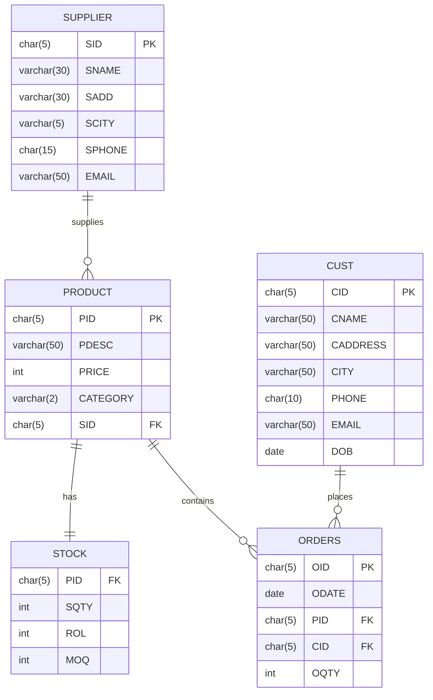

# Inventory Management System

## Project Overview 🚀
This project is a **SQL-based Inventory Management System** designed to efficiently track suppliers, products, stock, customers, and orders. The system leverages well-structured database tables, stored procedures, and triggers to automate stock management and ensure data consistency.

## Table of Contents 📑
- [Project Highlights](#project-highlights)
- [Key Functionalities](#key-functionalities)
- [Database Design](#database-design)
- [Entity-Relationship Diagram](#entity-relationship-diagram)
- [How to Use](#how-to-use)
- [Feedback & Contributions](#feedback--contributions)

## Project Highlights 🏆
- ✅ **Table Structures**: Well-designed schema for managing suppliers, products, orders, and stock.
- ✅ **Stored Procedures**: Automates key actions such as order placement, stock updates, and customer management.
- ✅ **Triggers**: Ensures real-time stock updates when orders are placed or products are modified.

## Key Functionalities ⚙️
- 🔸 **Automatic Stock Deduction**: When an order is placed, the stock is automatically deducted.
- 🔸 **Stock Deletion**: Products are removed from inventory when they are deleted.
- 🔸 **Real-Time Synchronization**: Ensures real-time synchronization between orders and stock levels.

## Database Design 🛠️
The system includes the following components:
- **Suppliers Table**: Stores vendor information with constraints to ensure data integrity.
- **Products Table**: Manages product details with category validation ('IT', 'HA', 'HC').
- **Stock Table**: Tracks inventory levels with reorder points and minimum order quantities.
- **Customer Table**: Maintains customer information with validation rules.
- **Orders Table**: Records all transactions linking customers to products.

## Entity-Relationship Diagram 📌
Below is the ER diagram showing primary and foreign key relationships:



## How to Use ⚡
1. **Clone the Repository**:  
   Clone this repository to your local machine using:
   ```bash
   git clone https://github.com/yourusername/inventory-management-system.git
   ```

2. **Set Up the Database**:  
   Execute the provided SQL scripts to create the database structure, tables, and stored procedures:
   - `Table Creation.sql` - Creates the database schema and tables
   - `Procedures.sql` - Implements stored procedures for data operations
   - `Triggers.sql` - Sets up automation triggers for real-time updates

3. **Run the System**:  
   Use SQL commands to interact with the database (e.g., placing orders, checking stock levels, managing suppliers).

4. **Use Stored Procedures**:  
   The system includes the following procedures for easy data management:
   - `ADDSUPPLIER` - Creates new supplier records with auto-generated IDs
   - `ADDPRO` - Adds new products to the inventory
   - `ADDCUST` - Registers new customers in the system
   - `ADDORDER` - Processes new orders with automatic stock updates

## Feedback & Contributions 💬
I'd love to hear your feedback or connect with others working on database-driven applications. Feel free to open an issue or submit a pull request if you have suggestions or improvements.

**#SQL** **#InventoryManagement** **#DatabaseDesign** **#StoredProcedures** **#Triggers** **#LearningByDoing**